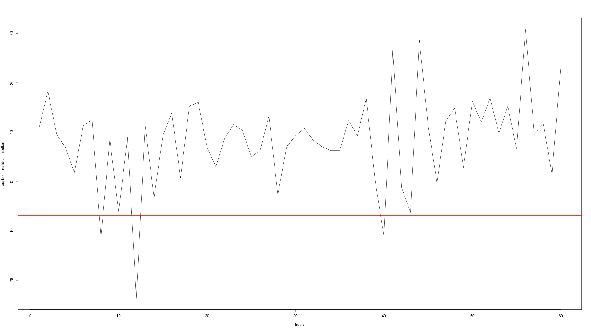
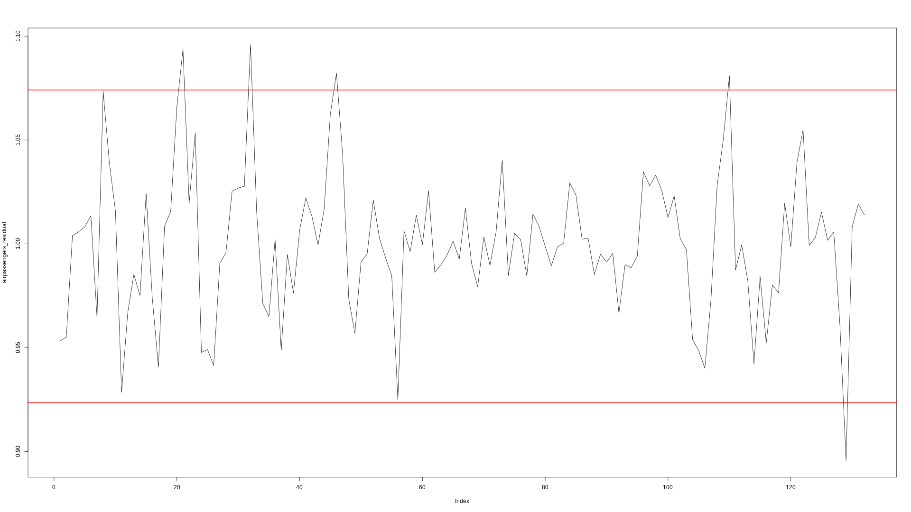

# time-serie

TimeSerie is a simple utility to use classical decomposition with Java and to detect anomalies in a time serie. Smoothing calculation is performed using moving average or moving median (for robustness to outliers).

Additive and multiplicative models are supported. Default is additive. Following examples/plots are created using R language.

## Getting started:

### Requires JDK 1.7+

version 0.0.1, to host on maven central.

## Examples

### anomaly detection with additive decomposition and moving median

Example using [dataset](https://www.rdocumentation.org/packages/fpp/versions/0.5/topics/ausbeer) of total quarterly beer production in Australia (in megalitres) from 1956:Q1 to 2008:Q3.

An example of decomposed time serie with moving median. 


The plot contains:

* original time serie
* trend component 
* season component
* residual component

i.e. Y(t) = T[t] + S[t] + R[t]

Components are definened respectively in `Serie#trend`, `Serie#season` and `Serie#residual` methods.

An example of anomaly detection.



```java
	List<Double> ausBeer = asList(236.,320.,272.,....);
	Serie s = new Serie(ausBeer, 4)
				.robust()
				.smoothWithMedian();
	...
	C;
```

creates a serie with trend calculated using moving median with order 4 (quarter data). `Serie#robust` method instructs serie in using a moving median with order 3 when detecting anomalies in residual/random component of the serie. `s.anomalies()` contains the 6 detected anomalies.
See also unit tests.


### anomaly detection using multiplicative decomposition and moving average

[Monthly Airline Passenger](https://stat.ethz.ch/R-manual/R-devel/library/datasets/html/AirPassengers.html) Numbers 1949-1960
The classic Box & Jenkins airline data. Monthly totals of international airline passengers, 1949 to 1960. 

An example of multiplicative decomposition using moving average.


```java
	List<Double> airPassengers = asList(112.,118.,132.,...);
	Serie serie = new Serie(airPassengers, 12).multiplicative();
	serie.trend();
	serie.season();
	serie.residual();
```

The plot contains:

* original time serie
* trend component 
* season component
* residual component

i.e. Y(t) = T[t] * S[t] * R[t]

An example of anomaly detection.




## Notes:

* Expectations defined in unit tests were obtained using R language rounding values.


